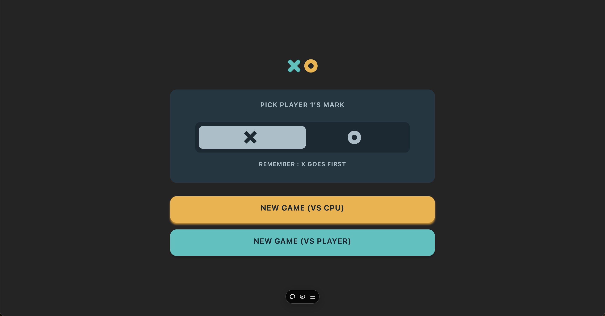
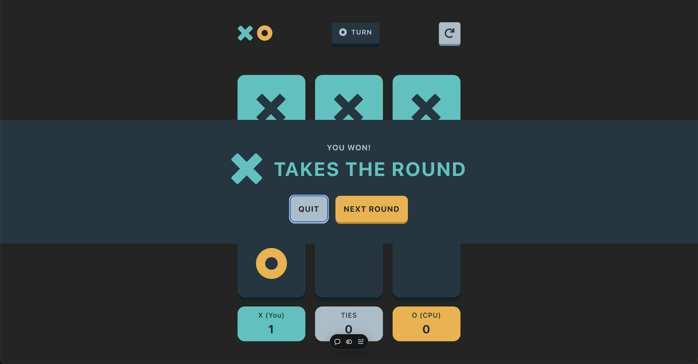

# Frontend Mentor - Tic Tac Toe solution

This is a solution to the [Tic Tac Toe challenge on Frontend Mentor](https://www.frontendmentor.io/challenges/tic-tac-toe-game-Re7ZF_E2v). Frontend Mentor challenges help you improve your coding skills by building realistic projects.

## Table of contents

- [Overview](#overview)
  - [The challenge](#the-challenge)
  - [Screenshot](#screenshot)
  - [Links](#links)
  - [Built with](#built-with)
- [Author](#author)
- [Acknowledgments](#acknowledgments)

## Overview

Lighthouse 100% Accessible animated React game. The application saves unfinished game progress to the local store. It has two modes player vs player and player vs CPU

### The challenge

Users should be able to:

- View the optimal layout for the game depending on their device's screen size
- See hover states for all interactive elements on the page
- Play the game either solo vs the computer or multiplayer against another person

### Screenshot

### Links

- Solution URL: [https://github.com/NikitaVologdin/React-TicTacToe-Game](https://github.com/NikitaVologdin/React-TicTacToe-Game)
- Live Site URL: [https://react-tic-tac-toe-game-blond.vercel.app/](https://react-tic-tac-toe-game-blond.vercel.app/)

### Built with

- Semantic HTML5 markup
- CSS custom properties
- Flexbox
- CSS Grid
- Mobile-first workflow
- Redux
- Post CSS
- [React](https://reactjs.org/) - JS library
- [Redux] (https://redux.js.org/) - JS library
- [React Router] (https://reactrouter.com/) - JS library

## Author

- Website - [Nikita Vologdin](https://vologdin.eu/portfolio)
- Frontend Mentor - [@NikitaVologdin](https://www.frontendmentor.io/profile/NikitaVologdin)

## Acknowledgments

Yaroslav Haldaj for the great help in the testing.
